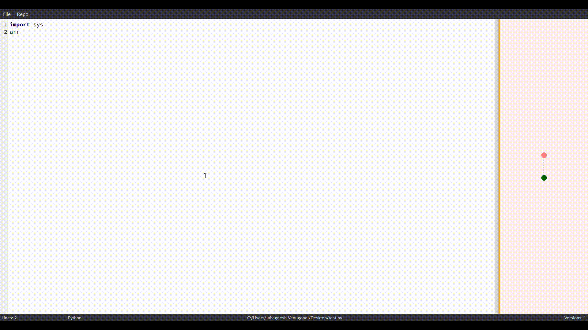
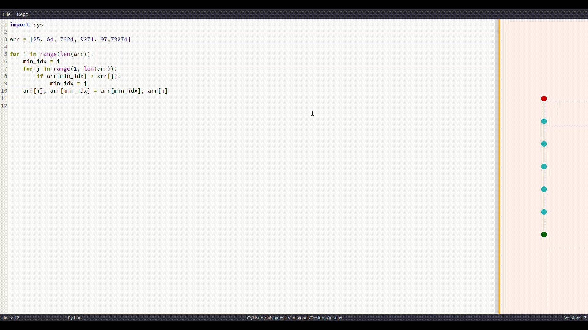
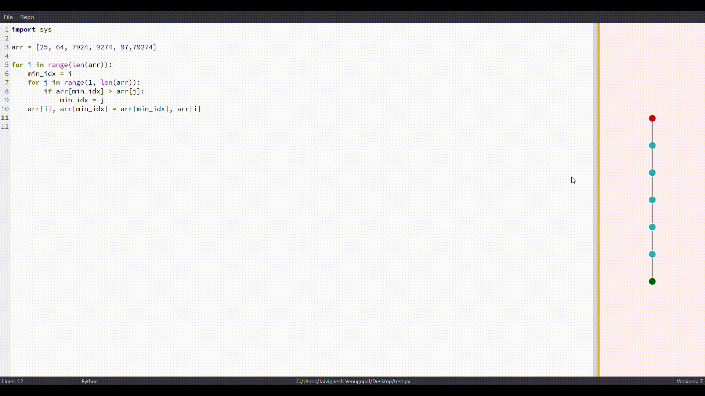

# Maroon Lines
### Introduction

Maroon Lines: A source code editor with in-built version controlling.

The goal of Maroon Lines is to introduce implicit version controlling for single files that would not usually be in the shadows of git.
One fine example would be code written for a leetcode/hacker-rank/kattis problem set. A programmer would generally not use git to save versions 
for a solution as git is more practical for projects. However, Maroon Lines paves a way for the programmer to store and view multiple solutions to a problem set in a single file, without requiring much effort at all. 

### Usage
Download the installer for either Windows/MacOS under 'Releases' before beginning to use the software.

#### Saving versions
A file has to be in storage before versioning could begin. Using the 'Save' or 'Save As' functionality implicitly saves a snapshot of the current state of the file.
 


#### Accessing versions
To access specific/previous versions, click on respective nodes or use the following shortcuts:
###### Windows
```
Alt + Up/Down/Right/Down 
```
###### MacOS
```
Option + Up/Down/Right/Down
```


#### Branching
To branch off from a file's edit history, move to a specific version and start editing. Follow the aforementioned instructions to save the new version.



#### Implicit Features
The versions are saved offline, which means that the versions exist even after the application is closed. Therefore, it is possible to leave the code on a certain node and come back later on to work on it. All versions will be retained.

#### Bottlenecks
Due to the way the application is designed, it is necessary to change the file's name or location only through the application. If not, renaming the file or moving it to a different location will break the link between the file and its history.
### Development
#### Install Pyenv
###### Ubuntu/Debian
```
sudo apt-get install -y make build-essential libssl-dev zlib1g-dev \
libbz2-dev libreadline-dev libsqlite3-dev wget curl llvm libncurses5-dev \
libncursesw5-dev xz-utils tk-dev libffi-dev liblzma-dev python-openssl

curl https://pyenv.run | bash
```

###### MacOS
```
brew install openssl readline sqlite3 xz zlib
curl https://pyenv.run | bash
```

###### Additional
The output will be based on your shell. But you should follow the instructions to add pyenv to your path and to initialize pyenv/pyenv-virtualenv auto completion. Once you’ve done this, you need to reload your shell:
```
exec "$SHELL" # Or just restart your terminal
```

#### Install Python 3.6.8
```
CONFIGURE_OPTS=--enable-shared pyenv install 3.6.8
```

#### Configure a new Virtual Environment
```
pyenv virtualenv 3.6.8 fbs
cd maroon-lines
pyenv local fbs
```

#### Install Pip Packages
```
pip install IPython wheel fbs pyqode.core pyqode.python networkx grave matplotlib==3.2.2 PyQt5==5.9.2 numpy==1.19.3
```

#### Generate Installer (on respective OS platforms)
```
fbs run
fbs freeze
fbs installer
```
### Credits
This application uses the following packages as primary building blocks:
1. [pyQode](https://github.com/pyQode) 
2. [NetworkX](https://networkx.org/)
3. [Grave](https://github.com/networkx/grave)
4. [PyQt5](https://www.riverbankcomputing.com/software/pyqt/)